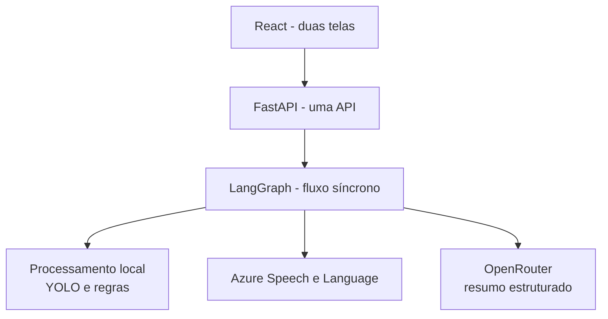
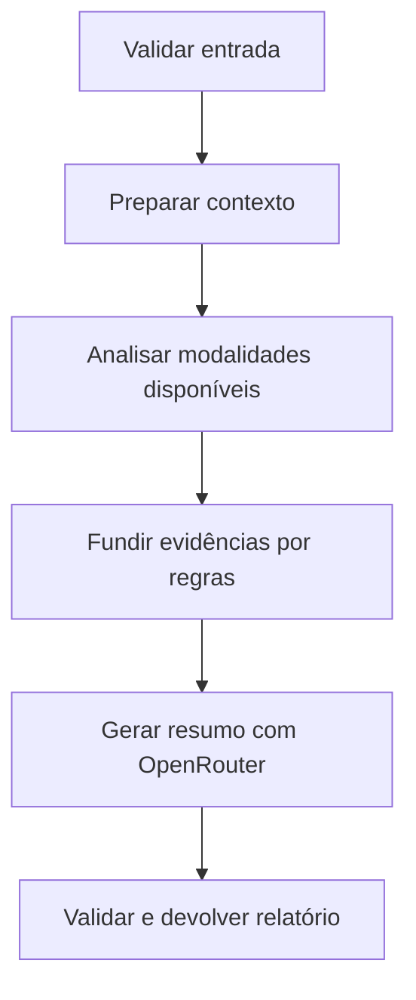
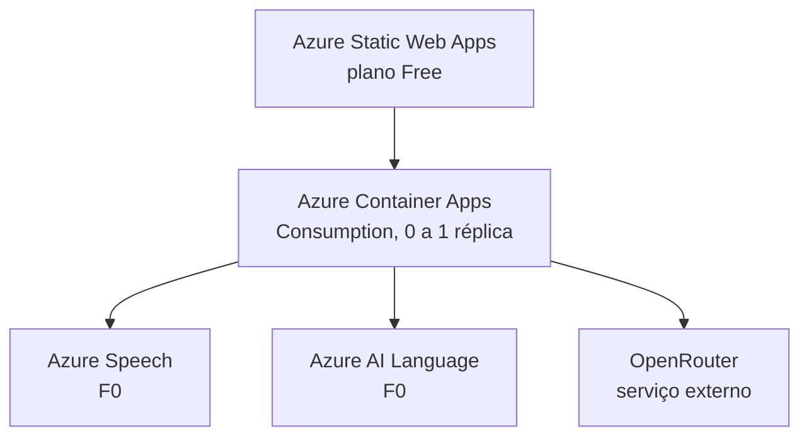

# NexoVital AI - Especificação do MVP Acadêmico

**Projeto:** Tech Challenge - Fase 4  
**Objetivo do documento:** substituir a especificação anterior por um escopo mínimo, demonstrável e alinhado ao PDF oficial  
**Idioma:** Português  
**Plataforma:** Web desktop  
**Ambiente:** um único ambiente de demonstração  
**Princípio central:** implementar somente o necessário para demonstrar o fluxo multimodal completo

---

## 1. Decisão de simplificação

O NexoVital AI será um demonstrativo acadêmico de apoio à análise médica multimodal, e não uma plataforma hospitalar completa.

O sistema terá:

- um único tipo de usuário: médico;
- nenhuma autenticação;
- apenas três pacientes fictícios;
- duas telas principais;
- uma análise executada na mesma requisição HTTP;
- uma pipeline LangGraph com caminho predeterminado;
- integrações reais com Azure e OpenRouter;
- dados preparados especificamente para a apresentação.

O sistema não fará diagnóstico. Ele exibirá achados, anomalias, correlações e um alerta demonstrativo que deverá ser interpretado por um profissional.

## 2. Objetivo do MVP

Permitir que um médico selecione um dos três pacientes, forneça vídeo, áudio, texto clínico, medicamentos e sinais vitais, execute uma análise multimodal e receba um relatório único com:

- achados por modalidade;
- anomalias detectadas;
- correlações entre os dados;
- nível de atenção;
- limitações causadas por dados ausentes;
- resumo clínico gerado por IA;
- aviso de uso acadêmico e não diagnóstico.

## 3. Alinhamento com o PDF oficial

| Requisito obrigatório | Implementação mínima no MVP | Evidência na demonstração |
| --- | --- | --- |
| Processar vídeo clínico | YOLOv8 Pose e regras simples de movimento | vídeo com esqueleto/frames e achados de movimento |
| Detectar eventos fora do padrão | assimetria, baixa amplitude, imobilidade ou movimento brusco | lista de eventos com instante e explicação |
| Gerar relatório de vídeo | resultado estruturado incorporado ao relatório final | seção "Vídeo" no resultado |
| Processar áudio de consulta | upload ou gravação, normalização e Azure Speech to Text | áudio, transcrição e métricas básicas |
| Detectar alterações relacionadas à fala | pausas, ritmo e termos associados a cansaço ou dificuldade respiratória | achados explicáveis, sem diagnóstico |
| Usar Azure Speech to Text | integração real no nó de áudio | transcrição retornada pelo Azure |
| Identificar termos e sentimento | Azure AI Language | termos-chave e sentimento no resultado |
| Detectar anomalias em sinais vitais | regras de faixa, tendência e z-score em CSV | gráfico/tabela com pontos anômalos |
| Detectar alteração em prescrições | comparação entre medicamentos anteriores e atuais | itens incluídos, removidos ou alterados |
| Analisar movimentação | saída do YOLOv8 Pose e heurísticas temporais | achados do vídeo |
| Gerar alerta para equipe médica | fusão determinística das evidências | nível NORMAL, ATENÇÃO ou ALERTA |
| Integrar serviços gerenciados em nuvem | Azure Static Web Apps, Container Apps, Speech e Language | aplicação publicada e recursos exibidos |
| Demonstrar fusão multimodal | LangGraph consolida as modalidades | relatório final com correlações |

## 4. Escopo funcional

### 4.1 Tela Pacientes

A tela exibirá exatamente três cards. Não será possível criar ou excluir pacientes.

Cada paciente poderá ter os seguintes dados editados para a demonstração:

- nome fictício;
- idade;
- sexo;
- resumo clínico;
- observações;
- medicamentos anteriores;
- CSV de sinais vitais;
- indicação de existência ou não de histórico prévio.

As alterações serão armazenadas no `localStorage` do navegador. Os dados iniciais virão de fixtures versionadas no frontend e poderão ser restaurados com a ação **Restaurar casos de demonstração**.

Não haverá banco de dados no MVP.

### 4.2 Tela Nova análise

Esta será a tela principal da aplicação.

Campos:

1. **Paciente**
   - seleção de um dos três pacientes;
   - resumo dos dados cadastrados;
   - indicação das modalidades disponíveis.

2. **Vídeo**
   - upload de arquivo; ou
   - gravação na hora pela câmera do navegador;
   - pré-visualização antes do envio;
   - opção de remover e gravar novamente.

3. **Áudio**
   - upload de arquivo; ou
   - gravação na hora pelo microfone;
   - reprodução antes do envio.

4. **Texto clínico**
   - campo livre para sintomas, evolução ou observações da consulta.

5. **Medicamentos atuais**
   - lista simples contendo nome, dose e frequência;
   - comparação com os medicamentos anteriores do paciente.

6. **Sinais vitais**
   - utiliza o CSV associado ao paciente;
   - permite substituir o CSV para a análise atual;
   - a ausência de CSV não impede a análise.

7. **Executar análise**
   - envia os dados para a API;
   - mostra um estado de carregamento com as etapas da pipeline;
   - aguarda a resposta final na mesma requisição;
   - exibe o resultado na própria tela, abaixo do formulário.

### 4.3 Resultado

O resultado terá apenas o necessário para a apresentação:

- nível geral: `NORMAL`, `ATENÇÃO` ou `ALERTA`;
- score demonstrativo de 0 a 100;
- resumo gerado pela IA;
- achados de vídeo;
- transcrição e achados de áudio;
- termos e sentimento do texto;
- anomalias dos sinais vitais;
- alterações de medicamentos;
- correlações multimodais;
- modalidades ausentes;
- limitações;
- aviso de que o resultado não é diagnóstico médico.

Não haverá dashboard, histórico de análises, auditoria, confirmação de alerta ou exportação em PDF.

## 5. Casos fixos de demonstração

Os nomes abaixo são exemplos e poderão ser alterados, desde que permaneçam fictícios.

### Paciente 1 - condição alterada

**Objetivo:** produzir um alerta claro e demonstrar convergência entre modalidades.

Dados preparados:

- CSV com queda de SpO2 e aumento de frequência respiratória;
- texto mencionando cansaço e falta de ar;
- áudio com pausas mais longas;
- vídeo curto com baixa amplitude ou menor estabilidade;
- alteração recente em um medicamento.

Resultado esperado: `ALERTA`.

### Paciente 2 - condição saudável

**Objetivo:** mostrar que o sistema também reconhece um caso sem anomalias relevantes.

Dados preparados:

- CSV com sinais vitais dentro das faixas demonstrativas;
- texto sem termos críticos;
- áudio sem pausas relevantes;
- vídeo com movimento de referência estável;
- medicamentos sem alteração.

Resultado esperado: `NORMAL`.

### Paciente 3 - caso neurológico sem histórico prévio

**Objetivo:** demonstrar tratamento correto de dados incompletos.

Dados preparados:

- resumo informando condição neurológica;
- vídeo e/ou áudio atual;
- nenhum CSV histórico e nenhuma prescrição anterior.

O sistema poderá apontar achados atuais, mas deverá:

- marcar a análise como parcial;
- informar que não existe baseline individual;
- reduzir a confiança apresentada;
- não interpretar ausência de dados como normalidade;
- não inventar alterações de prescrição.

Resultado esperado: `ATENÇÃO` ou resultado parcial, conforme os dados atuais.

## 6. Formato do CSV de sinais vitais

Formato mínimo aceito:

```csv
timestamp,heart_rate,systolic_bp,diastolic_bp,spo2,respiratory_rate,temperature
2026-07-16T10:00:00Z,78,120,80,98,16,36.6
2026-07-16T10:05:00Z,82,118,78,97,17,36.7
```

Regras:

- `timestamp` é obrigatório;
- ao menos uma coluna de sinal vital deve existir;
- células vazias são permitidas;
- colunas desconhecidas são ignoradas com aviso;
- o arquivo será limitado a 500 linhas no MVP;
- o frontend mostrará erros de formato antes da análise.

Faixas clínicas usadas nas regras serão declaradas como parâmetros de demonstração no código e no relatório técnico. Elas não serão apresentadas como protocolo médico validado.

## 7. Arquitetura mínima



### Componentes

- **Frontend:** React, TypeScript, Vite, Tailwind CSS e shadcn/ui.
- **Backend:** Python, FastAPI e Pydantic.
- **Orquestração:** LangGraph.
- **Vídeo:** OpenCV, FFmpeg e YOLOv8 Pose.
- **Áudio:** FFmpeg, Azure Speech to Text e métricas acústicas simples.
- **Texto:** Azure AI Language e regras de termos críticos.
- **Sinais vitais:** Pandas, regras, tendência e z-score.
- **Relatório:** OpenRouter com saída estruturada validada por Pydantic.

Não haverá microserviços. Todo o backend estará em uma única aplicação FastAPI.

## 8. Pipeline LangGraph

O LangGraph será usado como workflow com caminho controlado, não como agente autônomo.



O nó **Analisar modalidades disponíveis** executará somente os analisadores correspondentes aos dados enviados:

- `analyze_video`;
- `analyze_audio`;
- `analyze_text`;
- `analyze_vitals`;
- `analyze_medications`.

### Estado mínimo do grafo

```python
class AnalysisState(TypedDict):
    patient: dict
    available_modalities: list[str]
    video_result: dict | None
    audio_result: dict | None
    text_result: dict | None
    vitals_result: dict | None
    medication_result: dict | None
    deterministic_score: int
    risk_level: str
    correlations: list[dict]
    limitations: list[str]
    final_report: dict | None
```

### Execução

- o endpoint aguardará `graph.ainvoke(...)` terminar;
- do ponto de vista do produto, a análise será síncrona;
- não haverá fila, worker, job, retry assíncrono ou polling;
- se uma modalidade não for enviada, o grafo apenas registrará sua ausência;
- o timeout do cliente será compatível com os limites curtos de mídia.

## 9. Responsabilidade de cada analisador

### 9.1 Vídeo

Escopo mínimo:

- aceitar MP4, MOV ou WebM;
- normalizar o arquivo com FFmpeg;
- amostrar de 1 a 2 frames por segundo;
- executar YOLOv8 Pose;
- calcular presença da pessoa, amplitude aproximada, assimetria e variação de movimento;
- registrar os instantes de possíveis anomalias;
- salvar no resultado poucos frames anotados para exibição.

Não será implementada detecção de instrumentos cirúrgicos, análise completa de cirurgia ou validação fisioterapêutica.

### 9.2 Áudio

Escopo mínimo:

- aceitar WAV, MP3, M4A ou WebM;
- normalizar para um formato aceito pelo Azure Speech;
- obter transcrição real pelo Azure Speech to Text;
- calcular duração, percentual de silêncio, quantidade de pausas e ritmo aproximado;
- enviar a transcrição ao Azure AI Language;
- extrair sentimento e termos-chave;
- sinalizar termos críticos por uma lista transparente de palavras e expressões.

As métricas acústicas serão heurísticas demonstrativas. Não serão chamadas de detector clínico de disartria ou fadiga.

### 9.3 Texto

Escopo mínimo:

- analisar o texto digitado;
- extrair sentimento e termos-chave pelo Azure AI Language;
- identificar termos críticos configurados;
- devolver trechos que fundamentam os achados.

### 9.4 Sinais vitais

Escopo mínimo:

- validar e ler o CSV com Pandas;
- detectar valores fora das faixas configuradas;
- detectar tendência de piora;
- calcular z-score quando houver quantidade suficiente de pontos;
- devolver sinal, horário, valor, regra acionada e severidade.

Não serão usados Isolation Forest, treinamento de modelo ou streaming em tempo real.

### 9.5 Medicamentos

Escopo mínimo:

- comparar lista anterior e lista atual;
- detectar medicamento incluído ou removido;
- detectar mudança de dose ou frequência;
- registrar `sem histórico para comparação` quando não houver baseline.

Não haverá base farmacológica, verificação de interação medicamentosa ou recomendação de dose.

## 10. Fusão multimodal

A classificação será determinística e explicável.

Cada analisador devolverá:

```json
{
  "status": "ok",
  "severity": "NORMAL",
  "score": 0,
  "findings": [],
  "evidence": [],
  "limitations": []
}
```

Regras da fusão:

- modalidade ausente não recebe score zero;
- anomalia forte em sinais vitais pode elevar o alerta;
- evidências concordantes entre duas ou mais modalidades aumentam o score;
- ausência de histórico reduz confiança, mas não cria anomalia;
- o cálculo deverá informar quais regras contribuíram para o resultado;
- o OpenRouter não decidirá o nível de risco.

O OpenRouter receberá apenas os resultados estruturados e produzirá:

- resumo em linguagem natural;
- correlações explicadas;
- pontos que exigem revisão médica;
- limitações da análise.

A resposta do modelo será validada por um schema Pydantic. Texto livre fora do schema não será aceito como resultado final.

## 11. API mínima

### `GET /api/health`

Verifica se a API está ativa e informa a disponibilidade das configurações externas, sem expor segredos.

### `GET /api/demo-patients`

Retorna as fixtures iniciais dos três pacientes.

### `POST /api/analyze`

Recebe `multipart/form-data` com:

- snapshot JSON do paciente;
- vídeo opcional;
- áudio opcional;
- texto opcional;
- medicamentos atuais em JSON;
- CSV opcional.

Executa o LangGraph e devolve o relatório completo.

Não haverá outros endpoints no MVP.

## 12. Limites para manter a análise síncrona

- vídeo de até 30 segundos e 25 MB;
- áudio de até 2 minutos e 10 MB;
- CSV de até 500 linhas e 1 MB;
- somente uma pessoa principal no vídeo;
- uma análise por vez durante a apresentação;
- processamento de vídeo em CPU e por amostragem;
- arquivos temporários removidos ao final da requisição;
- nenhuma retenção de mídia no backend.

Se o processamento ultrapassar o timeout definido, a API devolverá erro claro. Não será criada infraestrutura assíncrona para contornar esse limite no MVP.

## 13. Tratamento de falhas e regra de não usar mocks

Os três pacientes e seus arquivos são **dados sintéticos de demonstração**, não mocks de integrações.

As integrações externas serão reais:

- Azure Speech to Text;
- Azure AI Language;
- OpenRouter.

Se uma credencial estiver ausente, a aplicação deverá impedir a execução dependente e indicar qual configuração falta.

Se um serviço externo falhar:

- não será fabricada uma resposta de sucesso;
- a modalidade será marcada como `failed`;
- a mensagem técnica será convertida em erro compreensível;
- o relatório poderá ser parcial apenas se ainda houver evidência real suficiente;
- a falha aparecerá nas limitações.

## 14. Azure no menor escopo possível



Recursos:

- **Azure Static Web Apps Free:** hospedagem do frontend.
- **Azure Container Apps Consumption:** hospedagem da única API, com `minReplicas: 0` e `maxReplicas: 1`.
- **Azure Speech F0:** transcrição do áudio da demonstração.
- **Azure AI Language F0:** sentimento e termos-chave.
- **GitHub Container Registry:** imagem Docker do backend, evitando Azure Container Registry.

Não serão criados:

- Cosmos DB;
- Blob Storage;
- Queue Storage;
- worker;
- Service Bus;
- Azure Functions;
- Azure Machine Learning;
- GPU;
- VNet;
- Key Vault;
- Application Insights dedicado;
- Entra ID;
- ambientes de staging e produção.

O Bicep terá somente os recursos usados. Um alerta de orçamento deverá ser configurado na assinatura. Free tier e grants reduzem o custo, mas a equipe deverá validar disponibilidade regional e limites da assinatura antes do deploy.

## 15. Variáveis de ambiente

```dotenv
AZURE_SPEECH_KEY=
AZURE_SPEECH_REGION=
AZURE_LANGUAGE_KEY=
AZURE_LANGUAGE_ENDPOINT=
OPENROUTER_API_KEY=
OPENROUTER_MODEL=
ALLOWED_ORIGINS=
```

Não haverá valores secretos versionados no Git.

## 16. Estrutura do repositório

```text
nexovital-ai/
├── frontend/
│   ├── src/
│   │   ├── pages/
│   │   │   ├── PatientsPage.tsx
│   │   │   └── AnalysisPage.tsx
│   │   ├── components/
│   │   ├── fixtures/
│   │   └── services/
│   └── package.json
├── backend/
│   ├── app/
│   │   ├── api.py
│   │   ├── graph.py
│   │   ├── state.py
│   │   ├── analyzers/
│   │   ├── services/
│   │   └── schemas.py
│   ├── tests/
│   ├── Dockerfile
│   └── pyproject.toml
├── demo-data/
│   ├── patient-altered/
│   ├── patient-healthy/
│   └── patient-neuro-no-history/
├── infra/
│   ├── main.bicep
│   └── demo.bicepparam
├── docs/
│   └── TECHNICAL_REPORT.md
├── openspec/
├── .env.example
└── README.md
```

Não haverá pasta `worker`, pacote compartilhado, múltiplas aplicações ou camadas arquiteturais artificiais.

## 17. Testes mínimos

### Backend

- validação de CSV;
- regras de sinais vitais;
- comparação de medicamentos;
- cálculo da fusão;
- comportamento com modalidade ausente;
- validação do schema retornado pelo OpenRouter;
- endpoint `/api/analyze` com adapters externos substituídos somente em testes automatizados.

### Frontend

- renderização dos três pacientes;
- persistência e restauração do `localStorage`;
- validação de arquivos;
- montagem do formulário de análise;
- exibição de sucesso, análise parcial e erro.

Mocks nao sao permitidos nem em cenarios de tests , tudo deve ser testado de forma real

## 18. Critérios de aceite

O MVP estará pronto quando:

- [ ] as duas telas funcionarem em desktop;
- [ ] os três pacientes fictícios estiverem disponíveis;
- [ ] os dados dos pacientes puderem ser editados e restaurados;
- [ ] for possível enviar ou gravar vídeo;
- [ ] for possível enviar ou gravar áudio;
- [ ] texto e medicamentos puderem ser informados;
- [ ] um CSV de sinais vitais puder ser associado ao paciente ou à análise;
- [ ] o YOLOv8 Pose gerar achados reais a partir do vídeo;
- [ ] o Azure Speech gerar a transcrição real;
- [ ] o Azure AI Language retornar sentimento e termos-chave reais;
- [ ] as anomalias de sinais vitais forem explicáveis;
- [ ] as alterações de medicamentos forem explicáveis;
- [ ] o LangGraph coordenar toda a pipeline;
- [ ] o OpenRouter gerar o resumo final estruturado;
- [ ] a análise terminar na mesma requisição, sem worker ou fila;
- [ ] o paciente saudável resultar em `NORMAL`;
- [ ] o paciente alterado resultar em `ALERTA`;
- [ ] o paciente neurológico sem histórico indicar análise parcial;
- [ ] a aplicação estiver publicada no Azure;
- [ ] o vídeo final demonstrar o fluxo em até 15 minutos;
- [ ] o relatório técnico documentar modelos, resultados, exemplos e limitações.

## 19. Fora do escopo

Para impedir crescimento indevido do projeto, os itens abaixo estão explicitamente fora do MVP:

- autenticação e autorização;
- perfis de enfermeiro, fisioterapeuta, auditor ou administrador;
- login mockado;
- dashboard;
- CRUD completo de pacientes;
- prontuário eletrônico;
- histórico de internações;
- banco de dados;
- armazenamento permanente de mídia;
- worker e filas;
- processamento em tempo real;
- WebSockets e polling;
- múltiplas análises simultâneas;
- revisão humana dentro do sistema;
- auditoria;
- notificações;
- geração de PDF;
- aplicativo mobile;
- detecção completa de cirurgia;
- diagnóstico de doença;
- recomendação de medicamento;
- validação farmacológica;
- treinamento ou fine-tuning de modelos;
- observabilidade corporativa;
- arquitetura de microserviços;
- múltiplos ambientes Azure.

Qualquer item desta lista somente poderá entrar após a entrega e gravação do MVP.

## 20. Plano OpenSpec reduzido

Usar apenas três mudanças, nessa ordem.

### Mudança 1 - `build-demo-interface`

Entrega:

- frontend React;
- duas telas;
- três fixtures de pacientes;
- edição em `localStorage`;
- gravação/upload de mídia;
- formulário e visual do relatório;
- FastAPI com `/api/health` e contratos iniciais.

### Mudança 2 - `implement-synchronous-multimodal-analysis`

Entrega:

- pipeline LangGraph;
- analisadores de vídeo, áudio, texto, sinais vitais e medicamentos;
- Azure Speech;
- Azure AI Language;
- fusão determinística;
- OpenRouter;
- `POST /api/analyze`;
- testes das regras centrais.

### Mudança 3 - `deploy-and-deliver-tech-challenge`

Entrega:

- Bicep mínimo;
- deploy no Azure;
- dados finais dos três casos;
- README;
- relatório técnico;
- roteiro e evidências para o vídeo de até 15 minutos.

Não criar specs separadas para autenticação, auditoria, fila, worker, dashboard ou banco.

## 21. Roteiro sugerido para a apresentação

1. Mostrar rapidamente os quatro requisitos do PDF.
2. Abrir a tela de pacientes e apresentar os três casos.
3. Executar o paciente saudável e mostrar o resultado `NORMAL`.
4. Executar o paciente alterado com vídeo, áudio, texto, CSV e medicamentos.
5. Mostrar a transcrição do Azure e os termos extraídos.
6. Mostrar a pose/anomalia de movimento no vídeo.
7. Mostrar os pontos anômalos do CSV.
8. Mostrar a alteração da prescrição.
9. Mostrar a fusão no LangGraph e o alerta final.
10. Abrir o paciente neurológico sem histórico e destacar a análise parcial.
11. Mostrar os recursos publicados no Azure.
12. Encerrar com limitações e aviso de não diagnóstico.

## 22. Referências técnicas

- Enunciado oficial: `8IADT - Fase 4 - Tech challenge (3)(2).pdf`.
- [LangGraph - Graph API](https://docs.langchain.com/oss/python/langgraph/graph-api)
- [Azure Static Web Apps - planos](https://learn.microsoft.com/en-us/azure/static-web-apps/plans)
- [Azure Container Apps - cobrança e grants](https://learn.microsoft.com/en-us/azure/container-apps/billing)
- [Azure AI Language - extração de frases-chave](https://learn.microsoft.com/en-us/azure/ai-services/language-service/key-phrase-extraction/quickstart)
- [Azure AI Language - análise de sentimento](https://learn.microsoft.com/en-us/azure/ai-services/language-service/sentiment-opinion-mining/quickstart)

---

## Decisão final

O MVP será considerado bem-sucedido se demonstrar, de ponta a ponta, uma única análise multimodal real e explicável. Nenhuma funcionalidade corporativa será implementada antes que esse fluxo esteja funcionando, publicado e pronto para ser apresentado.
