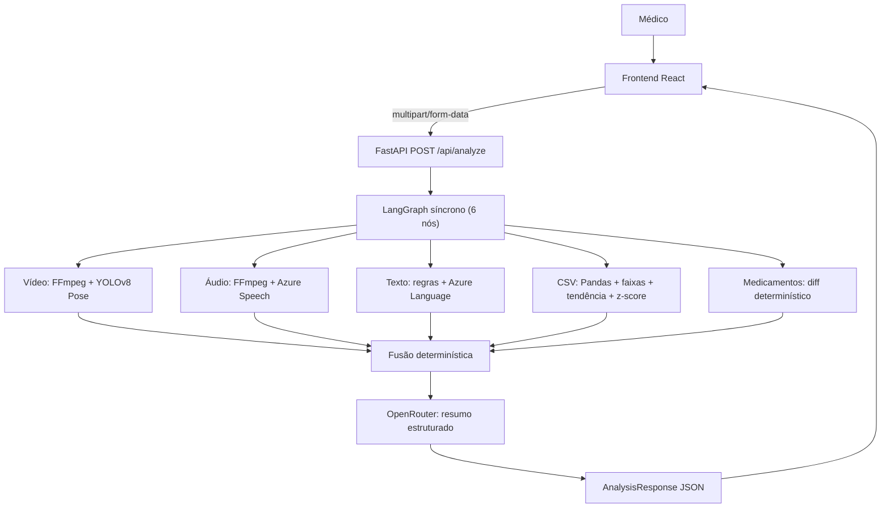
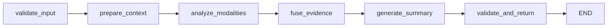

# NexoVital AI

Demonstrativo acadêmico de apoio à análise médica multimodal — Tech Challenge Fase 4.

> Especificação completa: [`NEXOVITAL_AI_MVP_SPEC.md`](NEXOVITAL_AI_MVP_SPEC.md).
> Documentação detalhada: [`docs-avaliacao/`](docs-avaliacao/) (7 arquivos para avaliação por IA/banca).

```text
nexovital-ai/
├── frontend/            # React + TypeScript + Vite + Tailwind + shadcn/ui
├── backend/             # FastAPI + LangGraph + analisadores
├── demo-data/           # Fixtures dos 3 pacientes de demonstração
├── infra/               # Bicep (Static Web App, Container Apps, Speech, Language)
├── docs-avaliacao/      # Documentação completa para avaliação (Fase 4)
└── examples/            # CSVs e prescrições de exemplo
```

---

## Stack

| Camada | Tecnologias |
| --- | --- |
| Frontend | React 18, TypeScript, Vite, Tailwind CSS, React Router v6, Recharts, shadcn/ui |
| Backend | Python 3.12+, FastAPI, Pydantic, LangGraph, httpx |
| Vídeo | FFmpeg, Ultralytics YOLOv8n Pose, NumPy |
| Áudio | FFmpeg/FFprobe, Azure Speech SDK (`pt-BR`) |
| Texto | Azure AI Language (sentimento + frases-chave), 35 termos críticos locais |
| Sinais vitais | Pandas, regressão linear, z-score (3 métodos de detecção) |
| Relatório IA | OpenRouter (Chat Completions), modelo `google/gemini-flash-1.5` |
| Infraestrutura | Docker Compose, Azure Bicep (F0/Free tier), CI/CD GitHub Actions |
| Qualidade | Pytest (32 testes), Vitest, ESLint, Ruff |

---

## Arquitetura



Pipeline LangGraph — 6 nós lineares compilados como singleton e executados via `ainvoke`:



### Resumo

O **Frontend React** (2 telas: `/pacientes` e `/analise`) coleta vídeo, áudio, texto, CSV e medicamentos via formulário multipart. A **API FastAPI** recebe no endpoint `POST /api/analyze`, valida tipo MIME e tamanho, e dispara o **grafo LangGraph** compilado (`_graph.ainvoke`).

O grafo executa 6 nós em sequência:
1. **validate_input** — identifica quais modalidades foram enviadas
2. **prepare_context** — verifica `has_history` e adiciona limitações
3. **analyze_modalities** — roda os 5 analisadores (sequencial)
4. **fuse_evidence** — calcula score determinístico e nível (NORMAL/ATENÇÃO/ALERTA)
5. **generate_summary** — chama OpenRouter para resumo textual
6. **validate_and_return** — fallback se OpenRouter falhar

Cada analisador opera de forma independente. Modalidades ausentes recebem `status: "missing"` e não interrompem a pipeline. A **fusão** aplica pesos por modalidade (vitals 0.30, video 0.25, audio 0.20, text 0.15, medications 0.10) mais regras heurísticas (convergência, ausência de histórico, anomalia forte em vitais). O **OpenRouter** gera causas, tratamentos e correlações — mas o nível de risco é sempre decidido deterministicamente pela fusão.

Não há banco de dados, worker, fila ou autenticação. O processamento é síncrono (tudo em uma requisição HTTP). Arquivos temporários são removidos ao final de cada analisador. Pacientes são persistidos apenas no `localStorage` do navegador.

**Princípio**: OpenRouter **não decide** o nível de risco — a fusão determinística decide. Modelo externo gera apenas o resumo textual (causas, tratamentos, correlações).

---

## Pré-requisitos

- Node.js 22+
- Python 3.12+ e [uv](https://docs.astral.sh/uv/)
- Docker + Docker Compose
- FFmpeg (para processamento de vídeo/áudio)

## Instalação

```bash
# Backend
cd backend && uv sync

# Frontend
cd frontend && npm install
```

## Desenvolvimento local

```bash
cp .env.example .env
docker compose up --build
```

- Frontend: http://localhost:5173
- API: http://localhost:8000 (health em `/api/health`)

## Variáveis de ambiente

| Variável | Uso | Padrão |
| --- | --- | --- |
| `AZURE_SPEECH_KEY` / `AZURE_SPEECH_REGION` | Speech to Text | — |
| `AZURE_LANGUAGE_KEY` / `AZURE_LANGUAGE_ENDPOINT` | Text Analytics | — |
| `OPENROUTER_API_KEY` | Resumo IA | — |
| `OPENROUTER_MODEL` | Modelo OpenRouter | `google/gemini-flash-1.5` |
| `CORS_ORIGINS` | Origens CORS | `http://localhost:5173` |
| `VITE_API_BASE_URL` | URL da API (frontend) | `http://localhost:8000` |

Demais variáveis em [`.env.example`](.env.example).

## Testes

```bash
# Backend — 32 testes
cd backend && uv run pytest

# Lint
cd backend && uv run ruff check .

# Frontend — build
cd frontend && npm run build && npm run lint
```

**Resultado em 17/07/2026**: 32 testes pytest passaram, Ruff passou, frontend build passou (chunk 581 kB).

---

## Infraestrutura Azure

```bash
az bicep build --file infra/main.bicep
```

| Recurso | Camada | Arquivo |
| --- | --- | --- |
| Azure Speech | F0 (free) | `infra/modules/cognitive-services.bicep` |
| Azure Language | F0 (free) | `infra/modules/cognitive-services.bicep` |
| Static Web App | Free | `infra/modules/static-web-app.bicep` |
| Container Apps | 0–1 réplica | `infra/modules/container-apps.bicep` |
| Budget | Alerta de custo | `infra/modules/budget.bicep` |

CI/CD: [`.github/workflows/`](.github/workflows/) — Python, Frontend, Containers (GHCR), Deploy Azure.

---

## Três pacientes demonstrativos

| ID | Paciente | Característica | Resultado esperado |
| --- | --- | --- | --- |
| `patient-altered` | Carlos Mendes, 58M | DPOC, SpO2 em queda (97→88), FR aumentada (16→28), alteração de medicamento | **ALERTA** |
| `patient-healthy` | Ana Beatriz Silva, 34F | Pós-cirúrgico, sinais estáveis, sem queixas | **NORMAL** |
| `patient-neuro-no-history` | Rafael Oliveira, 42M | Neurológico em investigação, sem baseline, sem CSV | **Parcial** |

Dados em [`demo-data/`](demo-data/). Fixtures versionadas em [`frontend/src/fixtures/patients.ts`](frontend/src/fixtures/patients.ts) e [`backend/app/api/demo_patients.py`](backend/app/api/demo_patients.py).

---

## Cinco analisadores

| Modalidade | Arquivo | Técnica | Peso na fusão |
| --- | --- | --- | ---: |
| Sinais vitais | `backend/app/analyzers/vitals.py` | Pandas + faixas + tendência linear + z-score | 0.30 |
| Vídeo | `backend/app/analyzers/video.py` | FFmpeg 2 FPS + YOLOv8n Pose + 8 heurísticas | 0.25 |
| Áudio | `backend/app/analyzers/audio.py` | Azure Speech + FFmpeg/FFprobe + termos críticos | 0.20 |
| Texto | `backend/app/analyzers/text.py` | Azure Language + 35 termos críticos | 0.15 |
| Medicamentos | `backend/app/analyzers/medications.py` | Diff determinístico (added/removed/modified) | 0.10 |

**Fusão** (`backend/app/analyzers/fusion.py`): média ponderada + regras heurísticas → score 0–100 → NORMAL (<30) / ATENÇÃO (30–69) / ALERTA (≥70).

---

## Formato da resposta

`POST /api/analyze` retorna JSON (`AnalysisResponse`):

| Campo | Tipo | Descrição |
| --- | --- | --- |
| `risk_level` | string | `NORMAL`, `ATENÇÃO` ou `ALERTA` |
| `score` | int | 0–100 (da fusão determinística) |
| `available_modalities` | list | Modalidades com dados enviados |
| `missing_modalities` | list | Modalidades não enviadas |
| `video`, `audio`, `text`, `vitals`, `medications` | object | Achados por modalidade (status, severity, score, findings, evidence) |
| `correlations` | list | Correlações entre modalidades |
| `limitations` | list | Limitações da análise |
| `ai_report` | object | Resumo, causas (5), tratamentos (5), pontos de revisão |
| `disclaimer` | string | "NÃO constitui diagnóstico médico" |

---

## Mapeamento de requisitos

| Requisito | Evidência | Status |
| --- | --- | --- |
| Análise de vídeo | YOLOv8n Pose + 8 heurísticas | Atendido |
| Análise de áudio | Azure Speech + métricas acústicas | Atendido |
| Análise de texto | Azure Language + 35 termos críticos | Atendido |
| Sinais vitais (CSV) | 3 métodos: faixas, tendência, z-score | Atendido |
| Medicamentos | Diff determinístico (added/removed/modified) | Atendido |
| LangGraph | 6 nós, StateGraph, `ainvoke` | Atendido |
| Azure Speech to Text | SDK oficial `pt-BR` | Atendido |
| Azure Language | SDK oficial (sentimento + frases-chave) | Atendido |
| Fusão multimodal | Pesos + regras heurísticas | Atendido |
| 3 pacientes | Fixtures + demo-data | Atendido |
| Resumo IA | OpenRouter com schema validado | Atendido |
| Alerta automático | Score + nível na tela (card visual) | Parcial |
| Deploy Azure | Bicep + CI/CD compilam | Parcial |
| Vídeo demonstrativo | Roteiro em `GUIA_VIDEO_DEMONSTRACAO.md` | Planejado |
| Notificação externa | Não implementado | — |

**21 Atendidos · 2 Parciais · 1 Planejado**

---

## Escopo do MVP

- 1 tipo de usuário (médico), sem autenticação
- 3 pacientes fictícios
- 2 telas (`/pacientes` e `/analise`)
- Análise síncrona via LangGraph
- Integrações reais: Azure Speech, Azure Language, OpenRouter, YOLOv8 Pose
- Sem banco de dados, worker, fila ou microserviço
- Persistência local no `localStorage` do navegador

---

## Documentação de avaliação

A pasta [`docs-avaliacao/`](docs-avaliacao/) contém a documentação completa para avaliação por IA/banca:

| Arquivo | Conteúdo |
| --- | --- |
| [`EVIDENCIAS_DO_CODIGO.md`](docs-avaliacao/EVIDENCIAS_DO_CODIGO.md) | Inventário de 76 evidências + limitações identificadas |
| [`MAPEAMENTO_REQUISITOS.md`](docs-avaliacao/MAPEAMENTO_REQUISITOS.md) | 28 requisitos mapeados ao código (tabela completa) |
| [`ARQUITETURA.md`](docs-avaliacao/ARQUITETURA.md) | Diagramas Mermaid, contrato API, decisões arquiteturais |
| [`RELATORIO_TECNICO.md`](docs-avaliacao/RELATORIO_TECNICO.md) | Relatório técnico com 22 seções |
| [`README_AVALIACAO.md`](docs-avaliacao/README_AVALIACAO.md) | Guia rápido para banca: stack, execução, variáveis |
| [`CHECKLIST_AVALIACAO_IA.md`](docs-avaliacao/CHECKLIST_AVALIACAO_IA.md) | 15 verificações objetivas para IA avaliadora |
| [`GUIA_VIDEO_DEMONSTRACAO.md`](docs-avaliacao/GUIA_VIDEO_DEMONSTRACAO.md) | Roteiro de vídeo ≤15 min (12 segmentos) |

---

Projeto demonstrativo acadêmico. Apoio à decisão médica. Não substitui diagnóstico.
