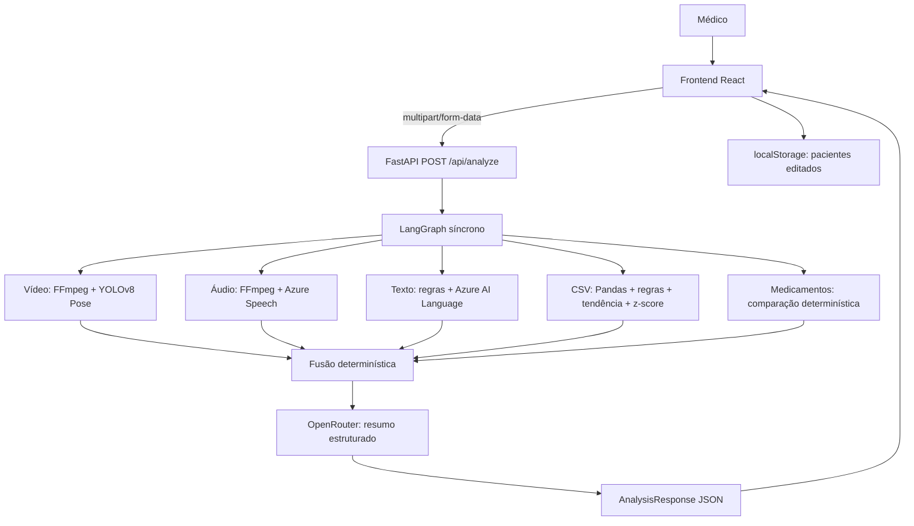
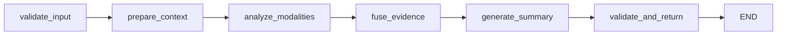
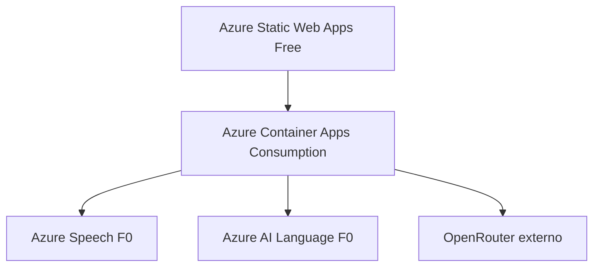

# Arquitetura — NexoVital AI

## 1. Visão geral

NexoVital AI usa arquitetura web monolítica no backend e frontend separado. Processamento ocorre em única requisição HTTP síncrona. Sistema não possui banco de dados, fila, worker ou autenticação.



## 2. Componentes

### 2.1 Frontend

- **Entrada**: `frontend/src/main.tsx`
- **Rotas**: `/pacientes` e `/analise` (React Router v6, BrowserRouter)
- **Fixtures**: `frontend/src/fixtures/patients.ts` — 3 pacientes (`patient-altered`, `patient-healthy`, `patient-neuro-no-history`)
- **Persistência**: `frontend/src/lib/storage.ts` — chave `nexovital_patients` no `localStorage`; validação e restore
- **Formulário e relatório**: `frontend/src/pages/AnalysisPage.tsx` — wizard de 6 etapas (`paciente`, `video`, `audio`, `texto`, `medicamentos`, `vitais`) + relatório de 9 abas (`visao-geral`, `video`, `audio`, `texto`, `medicamentos`, `vitais`, `pontos`, `causas`, `tratamentos`)
- **Gravação**: `frontend/src/components/VideoRecorder.tsx` (WebM, ≤30s, ≤25MB) e `AudioRecorder.tsx` (WAV, ≤2min, ≤10MB)
- **Gráfico de vitais**: `frontend/src/components/VitalSignsChart.tsx` — Recharts com tabela e lista de anomalias
- **Cliente HTTP**: `frontend/src/lib/api.ts` — `fetchHealth`, `fetchDemoPatients`, `submitAnalysis` (FormData multipart)
- **Componentes UI**: `frontend/src/components/ui/` — card, button, select, textarea, input, badge (shadcn/ui + Tailwind CSS)

Frontend carrega pacientes de fixtures/localStorage, monta `FormData` e mostra resposta no mesmo workspace.

### 2.2 API FastAPI

- **App factory**: `backend/app/main.py` — `create_app()`, CORS, handler global HTTP 500, 3 routers
- **Health**: `backend/app/api/health.py` — `GET /api/health` (status + flags azure_speech, azure_language, openrouter)
- **Pacientes demo**: `backend/app/api/demo_patients.py` — `GET /api/demo-patients` (3 pacientes fixos)
- **Análise**: `backend/app/api/analyze.py` — `POST /api/analyze` multipart; singleton `_graph = build_graph()`; validação de tamanho e MIME
- **Configuração**: `backend/app/core/config.py` — Pydantic Settings, `.env` (caminho absoluto local `C:/DEV/fiap-04-final/backend/.env`)

Middleware CORS aceita origens configuradas (`CORS_ORIGINS`). Handler global oculta detalhes de exceções não tratadas.

### 2.3 Pipeline LangGraph

- **Estado**: `backend/app/state.py` — `AnalysisState` (TypedDict com 6 campos de entrada + 10 de resultado) e `AnalyzerResult` (TypedDict com status, severity, score, findings, evidence, limitations)
- **Grafo**: `backend/app/graph.py` — `build_graph()` com 6 nós e arestas fixas



Pipeline é linear e síncrona. Nó `analyze_modalities` chama analisadores sequencialmente conforme dados presentes. Modalidades ausentes recebem `status: "missing"` com limitação descritiva.

### 2.4 Analisadores

| Modalidade | Arquivo | Processamento |
| --- | --- | --- |
| Vídeo | `backend/app/analyzers/video.py` | FFmpeg 2 FPS → YOLOv8n Pose → 8 heurísticas de keypoints COCO |
| Áudio | `backend/app/analyzers/audio.py` | FFmpeg WAV 16kHz mono → Azure Speech (pt-BR) → FFprobe/FFmpeg métricas acústicas → termos críticos |
| Texto | `backend/app/analyzers/text.py` | 35 termos críticos locais + Azure AI Language (sentimento + frases-chave) |
| Sinais vitais | `backend/app/analyzers/vitals.py` | CSV via Pandas → 3 métodos (faixas, tendência linear, z-score) com 6 colunas vitais |
| Medicamentos | `backend/app/analyzers/medications.py` | diff determinístico: added/removed/modified por nome, dose e frequência |
| Fusão | `backend/app/analyzers/fusion.py` | média ponderada + 5 regras heurísticas → score 0–100 → NORMAL/ATENÇÃO/ALERTA |

### 2.5 Relatório IA

`backend/app/services/openrouter_client.py`:
- Envia contexto estruturado à API OpenRouter (`POST /chat/completions`)
- System prompt com 12 regras: proíbe diagnóstico, exige disclaimer, cruza sintomas × medicamentos, correlaciona modalidades
- Exige JSON com schema mínimo: summary, correlations, review_points, limitations, 5 possible_causes, 5 possible_treatments
- 3 retries com backoff; fallback local quando não configurado
- Modelo configurável via `OPENROUTER_MODEL` (padrão: `google/gemini-flash-1.5`)

Modelo não escolhe nível final — recebe classificação determinística já calculada pela fusão.

## 3. Fluxo de dados

1. Paciente é selecionado no frontend (fixture ou localStorage).
2. Vídeo/áudio podem vir de arquivo ou `MediaRecorder`.
3. Texto e medicamentos são digitados no formulário.
4. CSV vem de preset (3 opções: saudável, taquicárdico, infarto) ou upload.
5. Frontend envia formulário multipart com 6 campos.
6. Backend valida JSON do paciente, MIME e tamanho dos arquivos.
7. Arquivos são mantidos em memória; analisadores criam temporários quando necessário.
8. LangGraph cria resultados por modalidade (6 nós em sequência).
9. Fusão calcula score ponderado e nível (NORMAL/ATENÇÃO/ALERTA).
10. OpenRouter tenta produzir relatório textual com causas e tratamentos.
11. Pydantic valida resposta HTTP (`AnalysisResponse`).
12. Frontend apresenta resultado em 9 abas.

Arquivos temporários de áudio e vídeo são removidos nos blocos `finally` dos analisadores. Não há retenção intencional no backend.

## 4. Contrato frontend/backend

### 4.1 Requisição

`POST /api/analyze` com `multipart/form-data`:

| Campo | Tipo | Obrigatório | Observação |
| --- | --- | --- | --- |
| `patient` | string (JSON) | selecionado pelo frontend | backend aceita vazio `{}` |
| `video` | arquivo | não | MP4, WebM ou QuickTime; até 25 MB |
| `audio` | arquivo | não | WAV, MPEG/MP3, MP4/M4A, WebM ou OGG; até 10 MB |
| `vitals_csv` | arquivo | não | CSV; até 1 MB e 500 linhas |
| `clinical_text` | string | não | texto livre |
| `medications` | string (JSON) | não | lista atual de medicamentos |

Frontend exige seleção de paciente. Backend não valida snapshot com schema `Patient`; faz apenas `json.loads`.

### 4.2 Resposta

Contrato está em `backend/app/schemas/analysis.py` e tipos equivalentes em `frontend/src/lib/api.ts`.

```json
{
  "risk_level": "ATENÇÃO",
  "score": 42,
  "available_modalities": ["text", "vitals"],
  "missing_modalities": ["video", "audio", "medications"],
  "video": {"status": "missing", "severity": "NORMAL", "score": 0, "findings": [], "evidence": [], "limitations": ["Vídeo não enviado."]},
  "audio": null,
  "text": {"status": "ok", "severity": "NORMAL", "score": 10, "findings": [...], "evidence": [...], "limitations": []},
  "vitals": {"status": "ok", "severity": "ALERTA", "score": 75, "findings": [...], "evidence": [...], "limitations": []},
  "medications": null,
  "correlations": [{"description": "...", "modalities": ["vitals"]}],
  "limitations": ["Azure AI Language não configurado..."],
  "ai_report": {
    "summary": "...",
    "correlations": [...],
    "review_points": [...],
    "limitations": [...],
    "possible_causes": [{"condition": "...", "rationale": "...", "urgency": "alta"}],
    "possible_treatments": [{"intervention": "...", "rationale": "...", "type": "exame"}]
  },
  "disclaimer": "ATENÇÃO: Este é um resultado DEMONSTRATIVO..."
}
```

Exemplo é estrutural, não resultado clínico real.

## 5. Integrações externas

### Azure Speech to Text

- SDK: `azure-cognitiveservices-speech`
- Idioma: `pt-BR`
- Método: `recognize_once()` — reconhecimento único de arquivo WAV
- Configuração: `AZURE_SPEECH_KEY` + `AZURE_SPEECH_REGION`
- Arquivo: `backend/app/analyzers/audio.py`

### Azure AI Language

- SDK: `azure-ai-textanalytics`
- Operações: `analyze_sentiment` e `extract_key_phrases`
- Configuração: `AZURE_LANGUAGE_KEY` + `AZURE_LANGUAGE_ENDPOINT`
- Usado no texto clínico; não aplicado à transcrição de áudio
- Arquivo: `backend/app/analyzers/text.py`

### OpenRouter

- HTTP `POST /chat/completions` via httpx
- Formato de resposta: JSON object com schema validado
- Timeout configurável (padrão 60s), 3 retries com backoff
- Fallback local quando serviço não está configurado ou falha
- Arquivo: `backend/app/services/openrouter_client.py`

### Ultralytics YOLOv8 Pose

- `YOLO("yolov8n-pose.pt")` — baixa ou usa cache local
- Keypoints COCO (17 pontos) da pessoa com maior confiança média
- Não existe empacotamento explícito do peso no Dockerfile
- Arquivo: `backend/app/analyzers/video.py`

## 6. Persistência

- **Backend**: nenhuma persistência. Arquivos temporários são removidos ao final de cada analisador.
- **Frontend**: pacientes editados são persistidos em `localStorage` pela chave `nexovital_patients`. Tema usa chave separada no `AppLayout`. Resultados de análise não são persistidos.
- **Mídias, CSVs e relatórios**: não são armazenados depois da sessão/requisição.

## 7. Tratamento de erros

| Condição | Resposta |
| --- | --- |
| JSON inválido | HTTP 422 (FastAPI/Pydantic) |
| Arquivo acima do limite | HTTP 413 (Payload Too Large) |
| MIME não permitido | HTTP 415 (Unsupported Media Type) |
| Pipeline com exceção | HTTP 500 com handler global |
| Falha de modalidade individual | `status: "failed"` + limitação; pipeline continua |
| Integração Azure indisponível | `status: "ok"` parcial + limitação descritiva |
| OpenRouter indisponível | fallback local: `ai_report.summary = "Relatório IA não disponível..."` |
| Frontend com erro | mensagem de erro retornada pela API exibida na tela |

Riscos identificados:
- Endpoint inclui mensagem de exceção interna no `detail` de falha da pipeline
- Tipos MIME dependem do valor informado pelo cliente (não validados por magic bytes)
- Duração máxima não é validada no backend (apenas tamanho)
- Conteúdo clínico segue para OpenRouter sem etapa explícita de anonimização

## 8. Infraestrutura prevista no código



- **Bicep**: `infra/main.bicep` — 4 módulos (`cognitive-services`, `container-apps`, `static-web-app`, `budget`)
- **Parâmetros**: `infra/parameters/demo.bicepparam` — usa `readEnvironmentVariable('OPENROUTER_API_KEY')`
- **CI/CD**: `.github/workflows/deploy-azure.yml` (OIDC login, validate, deploy com what-if)
- **Containers**: `.github/workflows/containers.yml` — build e push da imagem backend no GHCR
- **Status**: templates compilam; deploy ativo não comprovado

## 9. Decisões arquiteturais

| Decisão | Motivo | Consequência |
| --- | --- | --- |
| Única aplicação FastAPI | manter MVP pequeno | sem isolamento por serviço |
| Processamento síncrono | demonstração curta | timeout e baixa concorrência |
| LangGraph linear | evidenciar orquestração | sem branches/agente autônomo |
| Regras determinísticas para risco | explicabilidade | depende de calibração correta |
| OpenRouter apenas para texto | separar síntese de decisão | resumo pode faltar sem impedir classificação |
| Sem banco | escopo acadêmico | sem histórico ou auditoria |
| `localStorage` para pacientes | edição simples | dados restritos ao navegador |
| Arquivos temporários com cleanup | evitar retenção | reprocessamento necessário a cada análise |
| Azure F0/Free e escala 0–1 | reduzir custo | cold start e limites de cota |
| Scores 0–100 em cada analisador | normalização comum | fusão opera em escala uniforme |

## 10. Limites arquiteturais

- Não há notificação automática externa (e-mail, SMS, push, webhook)
- Não há controle de acesso ou autenticação
- Não há anonimização automática de dados
- Não há observabilidade distribuída (logs, metrics, tracing)
- Não há versionamento de modelo ou regras
- Não há validação clínica
- Não há garantia de processamento concorrente
- Deploy ativo e funcionamento das integrações externas ainda precisam comprovação
- Duração de mídia é limitada no frontend (30s vídeo, 2min áudio), mas não validada diretamente no backend
- `recognize_once()` do Azure Speech limita transcrição a segmento único

Projeto demonstrativo acadêmico. Apoio à decisão médica. Não substitui diagnóstico. Dados reais devem ser anonimizados. Resultado depende da qualidade dos dados de entrada.
