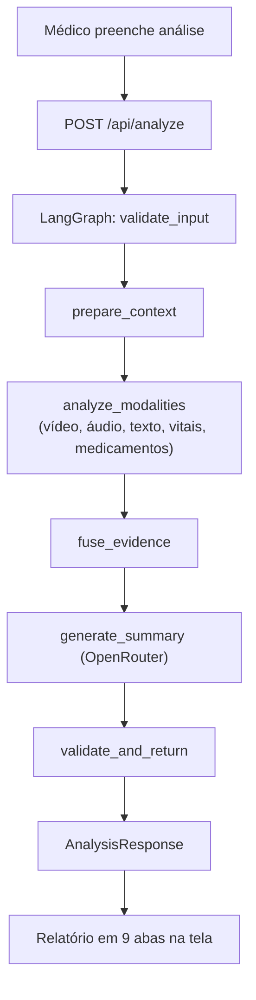

# Relatório técnico — NexoVital AI

## 1. Introdução

NexoVital AI é projeto demonstrativo acadêmico desenvolvido para o Tech Challenge — Fase 4. A solução reúne vídeo, áudio, texto clínico, prescrições e sinais vitais em fluxo único de apoio à análise médica multimodal, orquestrado por LangGraph e integrado com Azure Cognitive Services e OpenRouter.

Sistema não possui validação clínica e não deve ser usado para diagnóstico ou decisão autônoma. Dados reais devem ser anonimizados. Resultados variam conforme qualidade dos dados e disponibilidade dos serviços externos.

## 2. Contexto do desafio

O desafio solicita monitoramento multimodal de pacientes, incluindo análise clínica de mídia e texto, detecção de anomalias, uso de Azure Cognitive Services, alertas e documentação dos resultados.

Projeto adota recorte de MVP:

- Usuário único conceitual: médico
- Sem autenticação
- Três pacientes fictícios com dados sintéticos
- Processamento na mesma requisição HTTP (síncrono)
- LangGraph como workflow linear com 6 nós
- Sem banco de dados, worker, fila ou processamento contínuo
- Frontend desktop com duas telas (Pacientes e Análise)

## 3. Objetivos

### 3.1 Objetivo geral

Demonstrar fusão multimodal explicável, com processamento local e serviços externos, produzindo achados rastreáveis, score determinístico e nível de atenção (NORMAL/ATENÇÃO/ALERTA).

### 3.2 Objetivos específicos

- Receber vídeo e áudio por upload ou gravação no navegador
- Receber texto clínico e lista atual de medicamentos
- Processar sinais vitais em CSV com 3 métodos de detecção
- Comparar prescrição atual com histórico do paciente
- Detectar padrões de pose, fala, termos e sinais vitais
- Consolidar resultados em score determinístico
- Gerar resumo estruturado por IA externa (OpenRouter)
- Comunicar limitações e modalidades ausentes na resposta

## 4. Escopo real do MVP

Frontend expõe `/pacientes` e `/analise`. Pacientes podem ser editados e persistidos em `localStorage` (chave `nexovital_patients`). API expõe apenas:

- `GET /api/health`
- `GET /api/demo-patients`
- `POST /api/analyze`

Não existem autenticação, prontuário, histórico de análises, notificações externas, mensageria, dashboard administrativo ou persistência no backend.

## 5. Arquitetura geral

Frontend React (TypeScript, Vite, Tailwind CSS) monta `multipart/form-data` e chama FastAPI. Endpoint valida JSON, tamanho e tipo MIME, lê arquivos em memória e chama grafo compilado via `await _graph.ainvoke(state)`.

LangGraph executa, em ordem:

1. `validate_input` — identifica modalidades presentes
2. `prepare_context` — verifica histórico e adiciona limitações
3. `analyze_modalities` — executa 5 analisadores (sequencial)
4. `fuse_evidence` — fusão determinística com pesos e regras
5. `generate_summary` — chama OpenRouter para relatório textual
6. `validate_and_return` — fallback se OpenRouter falhar

Processamento é síncrono do ponto de vista HTTP. Não há execução paralela explícita dentro do nó de modalidades.

## 6. Fluxo multimodal implementado

Modalidade não enviada recebe `status: "missing"` e limitação descritiva. Falha de analisador individual é registrada como limitação, sem interromper a pipeline.

## 7. Modelos, serviços e técnicas

| Área | Modelo/serviço/técnica | Papel |
| --- | --- | --- |
| Vídeo | `yolov8n-pose.pt` via Ultralytics | Keypoints COCO (17 pontos) da pessoa principal |
| Áudio | Azure Speech to Text, idioma `pt-BR` | Transcrição via `recognize_once()` |
| Áudio local | FFmpeg/FFprobe | Normalização WAV 16kHz mono, duração, silêncio, volume médio |
| Texto | Azure AI Text Analytics | Sentimento e frases-chave |
| Texto local | 35 termos críticos | Regras transparentes por substring (severidade ALERTA/ATENÇÃO) |
| Vitais | Pandas, faixas, regressão linear e z-score | Validação e detecção de anomalias |
| Medicamentos | Comparação determinística | Added/removed/modified (nome, dose, frequência) |
| Fusão | Média ponderada + 5 regras heurísticas | Score 0–100 e nível NORMAL/ATENÇÃO/ALERTA |
| Relatório | OpenRouter Chat Completions | Resumo, correlações, causas e tratamentos possíveis |
| Orquestração | LangGraph `StateGraph` | Workflow controlado com 6 nós |

Modelo OpenRouter: `OPENROUTER_MODEL`, padrão `google/gemini-flash-1.5`.

## 8. Análise de vídeo

Implementação: `backend/app/analyzers/video.py`.

Fluxo:
1. Bytes são salvos em diretório temporário
2. FFmpeg normaliza vídeo para 2 FPS
3. Ultralytics carrega `yolov8n-pose.pt` (cache local ou download)
4. Pessoa com maior confiança média é selecionada
5. Keypoints COCO alimentam 8 heurísticas de dor/postura
6. Arquivos temporários são removidos no `finally`

Achados possíveis (8 indicadores):

- Postura de proteção (braço junto ao tronco)
- Mão próxima de cabeça/peito/abdômen
- Tensão dos ombros (espaço reduzido)
- Inclinação da cabeça (>20°)
- Postura antálgica (tronco inclinado lateralmente)
- Flexão dos cotovelos
- Agitação (variação alta entre frames) ou imobilidade
- Baixa presença no quadro (<30% de confiança)

Status: **Atendido com limitações**. Código executa pose estimation real, mas regras são heurísticas demonstrativas e não modelos clínicos validados. Não retorna frames anotados. Download inicial do peso YOLO pode exigir rede/cache. Duração máxima de 30s é imposta no frontend (gravação), mas backend valida apenas tamanho (25 MB).

## 9. Análise de áudio

Implementação: `backend/app/analyzers/audio.py`.

Fluxo:
1. Arquivo é normalizado por FFmpeg para WAV mono, 16kHz e 16 bits
2. Azure Speech reconhece fala com `recognize_once()` em `pt-BR`
3. FFprobe mede duração
4. FFmpeg `silencedetect` estima silêncio e pausas (>0.5s)
5. Volume médio contribui para aproximação de ritmo
6. Transcrição é cruzada com termos críticos locais

Status: **Atendido com limitações**. Integração Azure é real e condicional a credenciais. Função recebe parâmetros `azure_language_key` e `azure_language_endpoint`, mas Azure Language não é chamado dentro do analisador de áudio — transcrição não recebe análise de sentimento/frases-chave. Estimativa de sílabas por segundo é proxy heurístico. `recognize_once()` pode transcrever apenas segmento único, não consultas longas.

## 10. Análise textual

Implementação: `backend/app/analyzers/text.py` e `backend/app/analyzers/critical_terms.py`.

Analisador:
- Procura 35 termos críticos (respiratórios, cardiovasculares, neurológicos, gerais e de fala)
- Atribui score local: termos ALERTA +15, termos ATENÇÃO +10
- Chama Azure AI Language para sentimento (positivo/negativo/neutro/misto)
- Chama Azure AI Language para frases-chave
- Registra indisponibilidade externa como limitação

Severidade: score ≥ 40 → ALERTA, ≥ 20 → ATENÇÃO, < 20 → NORMAL.

Status: **Atendido**. Busca local usa substring simples e pode produzir falso positivo ou perder variantes linguísticas. Não há negação clínica, temporalidade ou reconhecimento de entidades médicas especializado.

## 11. Sinais vitais e CSV

Implementação principal: `backend/app/analyzers/vitals.py`. Pré-visualização frontend: `frontend/src/lib/vitals.ts` e `frontend/src/components/VitalSignsChart.tsx`.

Formato aceita `timestamp` e pelo menos uma coluna reconhecida:
- `heart_rate`, `systolic_bp`, `diastolic_bp`, `spo2`, `respiratory_rate`, `temperature`

Três métodos de detecção:

| Método | O que detecta | Threshold |
| --- | --- | --- |
| Faixas de referência | Valores fora de intervalos demonstrativos | Ex: SpO2 < 92 → ALERTA, FC > 100 → ATENÇÃO |
| Tendência linear | Inclinação de SpO2, FC e FR ao longo do tempo | Slope negativo em SpO2 → ALERTA, positivo em FC/FR → ATENÇÃO |
| Z-score | Desvios extremos da média da amostra | |z| > 2.5 com ≥10 pontos |

Status: **Atendido**. Faixas são parâmetros de demonstração, não protocolo clínico validado. Frontend e backend possuem regras ligeiramente diferentes; visualização local pode não coincidir exatamente com resposta do backend.

## 12. Medicamentos e prescrições

Implementação: `backend/app/analyzers/medications.py`.

Compara medicamentos pelo nome e detecta:
- **Adição**: nome na lista atual que não está no histórico → score +20
- **Remoção**: nome no histórico que não está na lista atual → score +15
- **Mudança de dose**: mesmo nome, dose diferente → score +10
- **Mudança de frequência**: mesmo nome, frequência diferente → score +5
- **Sem baseline**: `previous is None` → análise parcial, score 0

Severidade: score ≥ 50 → ALERTA, ≥ 30 → ATENÇÃO, < 30 → NORMAL.

Status: **Atendido parcialmente no caso sem histórico**. Para paciente neurológico (`patient-neuro-no-history`), fixture usa `previous_medications: []`, não `None`. Lista vazia é interpretada como baseline existente; qualquer medicamento atual vira "adição", sem limitação específica de prescrição. Grafo registra ausência geral de histórico via `has_history: false`, mas analisador de medicamentos não recebe essa flag.

Não há normalização de nomes, base farmacológica, interações medicamentosas, contraindicações ou recomendação segura de dose.

## 13. Detecção de anomalias

Anomalias são detectadas por regras independentes em cada modalidade:

| Modalidade | Método de detecção | Thresholds |
| --- | --- | --- |
| Vídeo | Geometria temporal dos keypoints COCO | Ângulos, distâncias, variação entre frames |
| Áudio | Silêncio, pausas, ritmo e termos críticos | Silêncio > 30%, pausas > 2, termos ALERTA |
| Texto | Termos críticos + sentimento Azure | Termos ALERTA +15, ATENÇÃO +10; sentimento negativo |
| Sinais vitais | Faixas, tendência linear, z-score | Faixas: thresholds por coluna; tendência: slope; z-score: |z| > 2.5 |
| Medicamentos | Diff determinístico | Adição +20, remoção +15, dose +10, frequência +5 |

Fusão (`backend/app/analyzers/fusion.py`) consolida:

| Modalidade | Peso |
| --- | ---: |
| Sinais vitais | 0.30 |
| Vídeo | 0.25 |
| Áudio | 0.20 |
| Texto | 0.15 |
| Medicamentos | 0.10 |

Regras adicionais:
1. Anomalia forte em sinais vitais (severidade ALERTA) → +15 pontos
2. Convergência: 2+ modalidades em ALERTA → +10 pontos
3. Sem baseline histórica → -10 pontos, confiança reduzida
4. Nenhuma anomalia detectada → score máximo limitado a 20
5. Divergência (mistura NORMAL + ALERTA) → correlação de inconsistência

Mapeamento score → nível: score ≥ 70 → ALERTA, ≥ 30 → ATENÇÃO, < 30 → NORMAL.

Fórmula base: média ponderada dos scores de cada modalidade (já em escala 0–100).

## 14. Uso de Azure

### 14.1 Runtime
- **Speech SDK**: `backend/app/analyzers/audio.py` — `SpeechConfig`, `SpeechRecognizer`, `pt-BR`
- **Text Analytics SDK**: `backend/app/analyzers/text.py` — `TextAnalyticsClient`, `analyze_sentiment`, `extract_key_phrases`
- **Health**: `GET /api/health` informa se credenciais estão preenchidas (flags booleanas)

Integrações dependem de configuração externa. Sem credenciais, sistema continua parcialmente e expõe limitações.

### 14.2 Infraestrutura
Bicep declara:
- Azure Speech `F0` (free tier)
- Azure AI Language/Text Analytics `F0` (free tier)
- Azure Static Web Apps `Free`
- Azure Container Apps com 0–1 réplica (consumption)
- Budget mensal com alerta de custo

`infra/main.bicep` e `infra/parameters/demo.bicepparam` compilam. Container App usa imagem pública no GHCR (`ghcr.io/lucsolv/fiap-04-nexovital-ai/backend:latest`) e injeta Azure Speech, Azure Language e OpenRouter como secrets/variáveis. Deploy ativo ainda não foi comprovado no repositório.

## 15. Uso de LangGraph

`backend/app/graph.py` implementa `StateGraph(AnalysisState)` com:

- 6 nós: `validate_input`, `prepare_context`, `analyze_modalities`, `fuse_evidence`, `generate_summary`, `validate_and_return`
- Arestas fixas e lineares até `END`
- Compilação singleton no carregamento do endpoint (`_graph = build_graph()`)
- Execução síncrona via `await _graph.ainvoke(state)`

Uso é adequado a workflow controlado, não agente autônomo. Não existem branches condicionais, memória entre execuções, ferramentas autônomas ou ciclos. Valor acadêmico está na orquestração explícita e estado tipado (`AnalysisState` como TypedDict).

## 16. OpenRouter e relatório IA

`backend/app/services/openrouter_client.py`:

- **System prompt**: 12 regras — proíbe diagnóstico, exige disclaimer, cruza sintomas com medicamentos, correlaciona modalidades
- **Formato de saída**: JSON com `summary`, `correlations`, `review_points` (2-5), `limitations`, `possible_causes` (5, com urgency), `possible_treatments` (5, com type)
- **Validação**: verifica campos obrigatórios e quantidades mínimas
- **Retry**: 3 tentativas com backoff
- **Fallback**: `ai_report.summary = "Relatório IA não disponível para esta análise."`

Modelo não decide nível de risco — recebe classificação determinística já calculada pela fusão. Timeout configurável (padrão 60s).

## 17. Formato da resposta final

`AnalysisResponse` (Pydantic) contém:

| Campo | Tipo | Descrição |
| --- | --- | --- |
| `risk_level` | string | NORMAL, ATENÇÃO ou ALERTA |
| `score` | int | 0–100 (da fusão determinística) |
| `available_modalities` | list[string] | Modalidades com dados enviados |
| `missing_modalities` | list[string] | Modalidades não enviadas |
| `video`, `audio`, `text`, `vitals`, `medications` | AnalyzerOutput \| null | Resultado por modalidade |
| `correlations` | list[dict] | Correlações entre modalidades |
| `limitations` | list[string] | Limitações da análise |
| `ai_report` | AiReport \| null | Resumo, correlações, causas e tratamentos |
| `disclaimer` | string | Aviso fixo de resultado demonstrativo |

`AnalyzerOutput`: status (ok/failed/missing), severity (NORMAL/ATENÇÃO/ALERTA), score (0–100), findings, evidence, limitations.

`AiReport`: summary, correlations, review_points, limitations, possible_causes (com urgency: baixa/média/alta), possible_treatments (com type: exame/medicamentoso/encaminhamento/terapia/monitoramento).

## 18. Exemplos de resultado esperado

### Paciente alterado (Carlos Mendes)

Dados sintéticos em `demo-data/patient-altered/` mostram queda de SpO2 (97→88), aumento respiratório (16→28) e FC crescente (84→111) em 11 registros. Transcrição descreve cansaço e falta de ar. Alteração de medicamento (Enalapril 10mg → 20mg). Resultado pretendido: **ALERTA**, com achados convergentes e recomendação de revisão imediata. Resultado real depende do vídeo/áudio fornecido e das credenciais externas.

### Paciente saudável (Ana Beatriz Silva)

`demo-data/patient-healthy/vitals.csv` mantém sinais estáveis. Transcrição sem sintomas críticos. Medicamento mantido igual ao histórico. Resultado pretendido: **NORMAL**, sem anomalias relevantes.

### Paciente neurológico sem histórico (Rafael Oliveira)

Fixture define `has_history: false`, `previous_medications: []`. Sem CSV histórico. Pipeline adiciona limitação "Paciente sem histórico clínico prévio" e fusão reduz score em 10 pontos. Resultado pretendido: análise parcial, potencialmente **ATENÇÃO**. Ausência de histórico sozinha não garante ATENÇÃO — mídia/texto atuais precisam fornecer achados.

## 19. Alertas

Sistema gera **alerta visual interno**: nível NORMAL, ATENÇÃO ou ALERTA aparece na resposta JSON e na tela com card colorido (verde/amarelo/vermelho com gradiente). Isso atende classificação automática de atenção.

Notificação automática para equipe médica — e-mail, SMS, push, webhook ou integração hospitalar — **não foi implementada**. Não existe confirmação, escalonamento ou auditoria de alerta.

## 20. Testes e qualidade

Resultados observados em 17/07/2026:

| Comando | Resultado |
| --- | --- |
| `uv run --directory backend pytest` | 32 testes passaram, 1 warning (httpx deprecation) |
| `npm --prefix frontend test -- --run` | 1 teste passou (AppLayout theme toggle) |
| `npm --prefix frontend run build` | passou; chunk JS 581,31 kB |
| `npm --prefix frontend run lint` | passou |
| `uv run --directory backend ruff check .` | passou; all checks passed |
| `az bicep build --file infra/main.bicep` | passou |
| `az bicep build-params --file infra/parameters/demo.bicepparam` | passou |

Distribuição dos 32 testes backend:
- `test_vitals.py`: 10 testes (faixas, tendência, z-score, normal)
- `test_medications.py`: 9 testes (adição, remoção, dose, frequência, sem baseline)
- `test_fusion.py`: 9 testes (ausência, convergência, histórico, escala)
- `test_demo_patients.py`: 2 testes (IDs esperados)
- `test_health.py`: 1 teste (status e flags)
- `test_analyze.py`: 1 teste (integração local POST com CSV e medicamentos reais)

Teste de integração local (`test_analyze.py`) cobre `/api/analyze` com CSV e medicamentos reais, sem mocks, mas não executa Azure, OpenRouter, FFmpeg ou YOLO.

mypy não pôde ser executado no ambiente Windows atual (bloqueio App Control em DLL do mypy).

## 21. Limitações e riscos

1. **Fusão saturável**: Média ponderada 0–100 com bônus aditivos (+15, +10) pode saturar score em 100 com facilidade em casos com múltiplas anomalias
2. **Evidências de vídeo**: `AnalyzerOutput.evidence` espera lista, mas vídeo pode retornar dicionário — cliente OpenRouter itera `evidence` antes da conversão no endpoint
3. **Áudio sem Language**: Transcrição Azure não é enviada ao Azure Language para sentimento/frases-chave
4. **Sem notificação externa**: Alerta visual não notifica equipe externamente
5. **Parâmetros Bicep**: `demo.bicepparam` usa `readEnvironmentVariable('OPENROUTER_API_KEY')` — requer configuração manual
6. **OpenRouter no Bicep**: Container App Bicep injeta OpenRouter como secret, mas configuração depende de deploy bem-sucedido
7. **Sem mídia binária**: `demo-data/` contém apenas roteiros/notas textuais, não arquivos reais de áudio/vídeo
8. **Duração não validada**: Backend configura limites de duração mas não os aplica — apenas tamanho é validado
9. **Sem negação clínica**: Termos críticos usam busca por substring, sem análise de negação ("sem dor" → detecta "dor")
10. **Medicamentos sem baseline**: `previous_medications: []` é tratado como baseline existente, não como ausência
11. **Sem testes externos**: Integrações Azure, OpenRouter e YOLO não têm cobertura de teste
12. **Workflow Python referencia worker**: CI `python.yml` não referencia worker, mas workflow de containers cria apenas backend/frontend
13. **mypy não verificado**: Ambiente Windows com App Control bloqueou execução do mypy
14. **Possíveis tratamentos por IA**: Causas e tratamentos gerados por OpenRouter exigem revisão profissional rigorosa
15. **Timeout síncrono**: Processamento em requisição única limita concorrência e impõe timeout ao cliente
16. **Cold start Azure**: Container Apps com escala 0–1 sofre latência de cold start
17. **CORS local**: Configuração de CORS aponta para `localhost:5173` por padrão

## 22. Conclusão

Projeto apresenta base funcional relevante: UI multimodal com gravação/upload, endpoint único, LangGraph real com 6 nós, analisadores de cinco modalidades, Azure Speech (SDK oficial), Azure Language (SDK oficial), YOLOv8 Pose, fusão determinística com pesos e regras, e relatório OpenRouter com schema validado.

Aderência é forte no núcleo demonstrativo — todas as cinco modalidades são processadas, anomalias são detectadas, score é calculado deterministicamente e resposta é estruturada. Principais lacunas para avaliação são: alerta externo não implementado, deploy Azure ativo não comprovado, ausência de mídia binária no repositório, testes de integrações externas inexistentes, e fórmula de fusão com potencial saturação.

Demonstração deve declarar essas limitações sem atribuir validade clínica ao sistema.

Projeto demonstrativo acadêmico. Apoio à decisão médica. Não substitui diagnóstico. Dados reais devem ser anonimizados. Resultado depende da qualidade dos dados de entrada.
